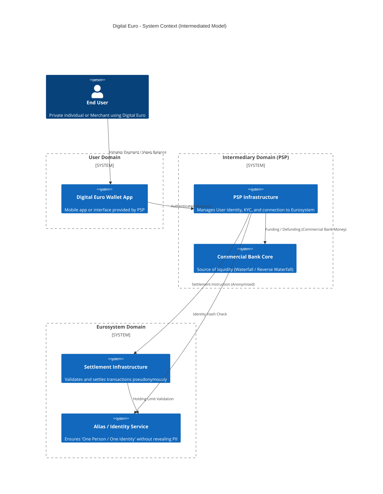

# System Context and Boundaries

## Purpose
This document defines the high-level **System Context** for the Digital Euro.
It identifies the external actors, the major logical systems, and the boundaries of responsibility between the private sector (Intermediaries) and the public sector (Eurosystem).

## Context Diagram
The Digital Euro ecosystem operates on a strict **Intermediated Model**.

## Domain Responsibilities

The architecture is divided into three distinct spheres of responsibility.

### 1. The User Domain (End Points)
* **Actors:** Private Individuals, Merchants, POS Terminals.
* **Components:** Mobile Applications, Web Interfaces, Smart Cards (for offline).
* **Responsibility:**
    * User Interface and experience.
    * Local management of cryptographic keys (if applicable) or secure authentication tokens.
    * **Offline Capability:** For offline payments, the User Domain acts as a peer-to-peer system where value transfers directly between devices (Secure Element to Secure Element).

### 2. The Intermediary Domain (The "Gatekeeper")
* **Actors:** Payment Service Providers (PSPs), Commercial Banks.
* **Upstream Rule Reference:** [`20-rulebook/actors-and-roles.md`](../20-rulebook/actors-and-roles.md)
* **Responsibility:**
    * **KYC/AML:** Verifying the identity of the user.
    * **User Management:** Mapping real-world identities to Digital Euro Aliases.
    * **Liquidity Management:** Executing the **Waterfall** and **Reverse Waterfall** logic. This domain bridges the gap between Commercial Bank Money (in `ComBank`) and Central Bank Money.
    * **Privacy Shield:** The Intermediary is the *only* entity that knows the link between the User's real identity (Name, IBAN) and their Digital Euro Wallet Address.

### 3. The Eurosystem Domain (The "Backbone")
* **Actors:** ECB, National Central Banks.
* **Responsibility:**
    * **Settlement:** Moving value between wallet addresses.
    * **Double-Spending Prevention:** Ensuring units are not spent twice (for online).
    * **Holding Limit Enforcement:** Ensuring no individual exceeds the limit, using hashed identifiers provided by the Alias Service.
    * **Issuance:** Creation and destruction of Digital Euro units based on collateral from Intermediaries.

## Key Architectural Flows

### A. Onboarding & Identity Linking
1.  User identifies themselves to the **PSP**.
2.  PSP performs KYC.
3.  PSP computes a **Unique Identity Hash** (based on national ID, etc.) and registers it with the **Alias Service**.
4.  **Alias Service** confirms if the user already exists (enforcing *One Person/One Identity*) without storing the user's name.

### B. Payment & Settlement
1.  User initiates payment via **Wallet App**.
2.  **PSP** validates the request and forwards a settlement instruction to the **Settlement Engine**.
3.  **Settlement Engine** moves funds pseudonymously.
4.  **Settlement Engine** confirms success to Payer PSP and Payee PSP.

### C. The Waterfall (Funding)
* **Upstream Rule Reference:** [`20-rulebook/liquidity-and-waterfall.md`](../20-rulebook/liquidity-and-waterfall.md)
1.  If User balance is insufficient, **PSP** triggers a debit from **Commercial Bank Core**.
2.  PSP instructs **Eurosystem DCA** to mint/transfer Digital Euro to User.
3.  User pays immediately (Atomic Transaction).

## Interfaces

This architecture implies the existence of the following high-level interfaces (to be specified in `40-specifications`):

1.  **I_Onboarding:** API for PSPs to register/check User Hashes.
2.  **I_Settlement:** API for PSPs to submit payment instructions.
3.  **I_Funding:** Internal PSP interface to Commercial Core Banking.