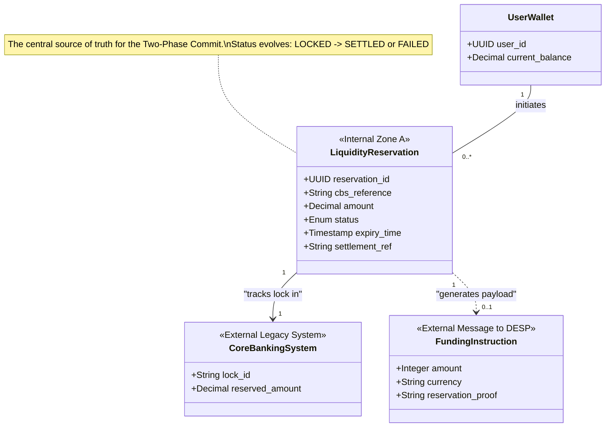

# Liquidity Reservation — Data Model Specification

## 1. Identification
- **Global ID:** `SPEC-LIQ-DATA`
- **Part of Set:** `SPEC-SET-LIQ`
- **Traceability:**
    - **Upstream Spec:** `SPEC-LIQ-FUNC` (Defines the states requiring storage)
    - **Upstream Arch:** `@arch=SET-ARCH:0.1.0` (Defines `COMP-PSP-02` boundary)

## 2. Purpose and Scope

This document defines the **schema and data integrity rules** for the Waterfall Engine (`COMP-PSP-02`).

It governs:
1.  **Data at Rest:** The `LiquidityReservation` entity stored by the PSP to manage the "Lock" state.
2.  **Data in Motion:** The `FundingPayload` and `DefundingPayload` exchanged with the DESP via `SPEC-LIQ-INT`.

## 3. Conceptual Data Model

### 3.1 Design Rationale: The "Split-State" Pattern

To support the **Two-Phase Commit** defined in `SPEC-LIQ-FUNC`, the data model strictly separates the **Internal State** from the **External Message**.

1.  **Persistence Requirement (`COMP-PSP-02`):** The Waterfall Engine must maintain a persistent record (`LiquidityReservation`) of every commercial lock. This ensures that if the system crashes after locking funds but before funding, the recovery process can identify the "Orphan Lock" and either complete or void it (Satisfying `REQ-LIQ-02`).

2.  **Privacy Barrier (`Zone A` vs. `Zone B`):** The internal record contains proprietary Core Banking references (`cbs_reference`). These MUST NOT be exposed to the DESP. Therefore, the external `FundingInstruction` carries only a sanitized "Reservation Proof" (Hash), complying with privacy mandates.

The following diagram illustrates the relationship between the User's Wallet, the internal Reservation record, and the external Settlement transaction.

**Visualisation (Normative)**

## 4. Data Dictionary

### 4.1 Entity: LiquidityReservation (Internal)
**Storage Target:** PSP Database (Zone A)
**Purpose:** Tracks the lifecycle of a Commercial Bank Money lock to ensure it is eventually Captured or Voided.

| Field Name | Data Type | Required | Description | Trace |
| :--- | :--- | :--- | :--- | :--- |
| **reservation_id** | `UUID` | Yes | Primary Key. Unique internal identifier for this operation. | `DAT-LIQ-01` |
| **user_id** | `UUID` | Yes | Foreign Key to the PSP's local customer table. | `DAT-LIQ-02` |
| **cbs_reference** | `String` | Yes | The ID returned by the Core Banking System during `LockFunds`. Used to trigger Capture/Void. | `REQ-LIQ-FUNC-02` |
| **amount** | `Decimal` | Yes | The value locked in the Core Banking System. | `LIQ-01` |
| **status** | `Enum` | Yes | `LOCKED`, `SETTLED`, `VOIDED`, `FAILED`. | `SPEC-LIQ-FUNC` (Sec 4) |
| **expiry_time** | `Timestamp` | Yes | The time at which the Core Banking lock auto-expires (TTL). | `INT-LIQ-01` |
| **settlement_ref** | `String` | No | The Transaction ID returned by DESP upon successful Funding. Populated only in `SETTLED` state. | `AUD-LIQ-01` |

### 4.2 Entity: FundingRequest (External Payload)
**Transmission Target:** Access Gateway (`I_Settlement`)
**Purpose:** The payload sent to `OP-LIQ-01` (POST /fund) to request issuance.

| Field Name | Data Type | Format | Description | Trace |
| :--- | :--- | :--- | :--- | :--- |
| **amount** | `Integer` | `int64` | Amount in cent-euros (e.g., `1000` = €10.00). | `DAT-MSG-01` |
| **currency** | `String` | `ISO 4217` | Fixed value: `EUR`. | `DAT-MSG-02` |
| **reservation_proof** | `String` | `SHA-256` | A hash or opaque reference to the `reservation_id`. Allows the PSP to link the Mint event to the Lock event in audits without revealing internal IDs to DESP. | `SEC-LIQ-01` |
| **remittance_info** | `String` | `Max 140` | (Optional) Reference for the bank statement (e.g., "Top-up 2024-01-01"). | `UX-01` |

### 4.3 Entity: DefundingRequest (External Payload)
**Transmission Target:** Access Gateway (`I_Settlement`)
**Purpose:** The payload sent to `OP-LIQ-02` (POST /defund) to offload excess liquidity.

| Field Name | Data Type | Format | Description | Trace |
| :--- | :--- | :--- | :--- | :--- |
| **amount** | `Integer` | `int64` | Amount to defund (burn). | `DAT-MSG-03` |
| **reason_code** | `String` | `Enum` | `LIMIT_BREACH`, `ZERO_HOLDING_CONFIG`. | `DAT-MSG-04` |

## 5. Data Integrity & Privacy Rules

| ID | Rule Name | Logic | Trace |
| :--- | :--- | :--- | :--- |
| **DAT-VAL-01** | **Amount Precision** | All monetary values MUST be stored and transmitted as **Integers** (Minor Units / Cents) to prevent floating-point rounding errors. | `ARCH-STD-01` |
| **DAT-PRI-01** | **Opaque References** | The `reservation_proof` sent to DESP MUST NOT contain PII or raw Core Banking IDs. It must be a random UUID or Hash generated by the Waterfall Engine. | `PRIV-01` |
| **DAT-INT-01** | **Orphan Prevention** | A `LiquidityReservation` record MUST NOT be deleted until it reaches a terminal state (`SETTLED` or `VOIDED`). | `ACID` |

---

## Appendix: How to Parse This Specification

**For Automation Engineers:**

1.  **Schema Validation:**
    - Parse **Section 4.2 and 4.3**.
    - **Generate:** JSON Schema or Protobuf definitions for the `I_Settlement` API.
    - *Validation:* Ensure `amount` is strictly typed as `integer`, not `float`.

2.  **Database Migration:**
    - Parse **Section 4.1**.
    - **Generate:** SQL Migration script (e.g., `CREATE TABLE liquidity_reservations ...`).
    - *Constraint:* Ensure `cbs_reference` has a Unique Index to prevent double-usage of the same bank lock.

