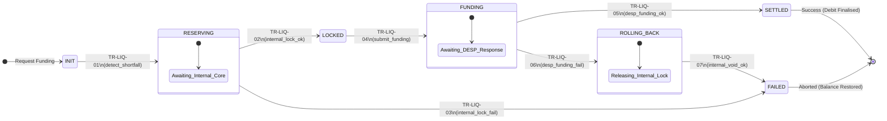

# Liquidity Reservation — Functional Specification

## 1. Identification
- **Global ID:** `SPEC-LIQ-FUNC`
- **Part of Set:** `SPEC-SET-LIQ`
- **Traceability:**
    - **Upstream Rulebook:** `@rule=SET-RULEBOOK:0.9.0`
    - **Upstream Arch:** `@arch=SET-ARCH:0.1.0`

## 2. Purpose and Scope

This document defines the **functional behaviour** of the **Waterfall Engine (`COMP-PSP-02`)**.

It specifies the **Reservation State Machine** required to bridge the PSP's internal **Commercial Bank Core** (Legacy) with the **Digital Euro Service Platform (DESP)**, ensuring atomic funding and defunding.

## 3. General Principles

### 3.1 Architectural Strategy: The Two-Phase Commit
To satisfy the strict atomicity requirements of `Rule LIQ-01`, the Waterfall Engine implements a **Two-Phase Commit (2PC)** pattern.
* **Internal Leg (Phase 1):** The engine instructs the PSP's own Core Banking System to **Lock** funds. This is a proprietary, internal action.
* **External Leg (Phase 2):** The engine instructs the **DESP** (via `COMP-EUR-05`) to **Fund** (Issue) Digital Euro.
* **Result:** The DESP is the authoritative issuer, but it relies on the PSP's guarantee that commercial funds have been reserved.

### 3.2 Key Requirements

| ID | Principle | Requirement Statement | Trace |
| :--- | :--- | :--- | :--- |
| **REQ-LIQ-01** | **Atomic Conservation** | The sum of Commercial Bank Money + Digital Euro MUST remain constant. Funds MUST NOT be double-spendable. | `Rule LIQ-01` |
| **REQ-LIQ-02** | **Fail-Safe Rollback** | If the DESP (`COMP-EUR-04`) rejects the funding (e.g., limit breach), the internal commercial reservation MUST be released immediately. | `Rule LIQ-01` |
| **REQ-LIQ-03** | **Limit Precedence** | Incoming payments breaching the Holding Limit MUST trigger an automatic "Reverse Waterfall" to offload excess funds to the Commercial Bank Core. | `Rule LIQ-02` |

## 4. Reservation Lifecycle States

The lifecycle of a single **Liquidity Operation** within the Waterfall Engine (`COMP-PSP-02`).

| State | Description | Asset Status |
| :--- | :--- | :--- |
| `INIT` | Request received. Calculating shortfall. | No change. |
| `RESERVING` | Engine is instructing internal Core Banking to lock funds. | **Internal:** Pending Lock **DESP:** Unchanged |
| `LOCKED` | Commercial funds are reserved internally. Ready to Fund. | **Internal:** Locked **DESP:** Unchanged |
| `FUNDING` | Request sent to DESP (`COMP-EUR-05`). Awaiting finality. | **Internal:** Locked **DESP:** Pending Issuance |
| `SETTLED` | DESP confirmed Funding. Commercial funds finalized (debited). | **Internal:** Debited **DESP:** Credited |
| `ROLLING_BACK`| DESP failed. Unlocking Commercial funds. | **Internal:** Releasing Lock **DESP:** Failed |
| `FAILED` | Operation aborted. Funds restored to original state. | **Internal:** Restored **DESP:** Failed |

## 5. State Machine & Transitions

### Transition Logic

**Parsing Context:** `Scope: WaterfallStateMachine`

| Trans ID | From State | To State | Trigger | Guard / Logic | Trace |
| :--- | :--- | :--- | :--- | :--- | :--- |
| **TR-LIQ-01** | `INIT` | `RESERVING` | `detect_shortfall` | **Calc:** `Shortfall = Payment - Balance`. | `LIQ-01` |
| **TR-LIQ-02** | `RESERVING` | `LOCKED` | `internal_lock_ok` | **Action:** PSP Core Banking confirms reservation ID. | `COMP-PSP-02` |
| **TR-LIQ-03** | `RESERVING` | `FAILED` | `internal_lock_fail` | **Error:** Insufficient Commercial Funds (NSF). | `LIQ-01` |
| **TR-LIQ-04** | `LOCKED` | `FUNDING` | `submit_funding` | **Action:** Call `POST /fund` on Access Gateway (`COMP-EUR-05`). | `COMP-EUR-01` |
| **TR-LIQ-05** | `FUNDING` | `SETTLED` | `desp_funding_ok` | **Action:** Instruct Internal Core to "Capture" the lock. | `LIQ-01` |
| **TR-LIQ-06** | `FUNDING` | `ROLLING_BACK`| `desp_funding_fail` | **Trigger:** Timeout/Error from DESP. **Action:** Instruct Internal Core to "Void" lock. | `REQ-LIQ-02` |
| **TR-LIQ-07** | `ROLLING_BACK`| `FAILED` | `internal_void_ok` | **Action:** Notify User of failure. | `NFR-REL-01` |

## 6. Functional Requirements (The Logic)

### 6.1 Funding Logic (The Waterfall)
**Target:** `COMP-PSP-02` (Waterfall Engine)

- **REQ-LIQ-FUNC-01:** Upon detection of `shortfall`, the engine MUST initiate a **Synchronous Hold** on the user's linked Commercial Bank Account.
- **REQ-LIQ-FUNC-02:** This interaction is **internal** to the PSP (Zone A) and outside the scope of Scheme Interfaces, but the *result* (Success/Failure) determines the next step.
- **REQ-LIQ-FUNC-03:** Only upon successful internal lock, the engine SHALL transmit a `FundingInstruction` to the DESP (`COMP-EUR-04`).

### 6.2 Defunding Logic (The Reverse Waterfall)
**Target:** `COMP-PSP-02` (Waterfall Engine)

- **REQ-LIQ-FUNC-04:** Upon detecting a Holding Limit breach, the engine MUST immediately calculate `excess`.
- **REQ-LIQ-FUNC-05:** The engine MUST instruct the DESP to **Defund** the `excess` amount.
- **REQ-LIQ-FUNC-06:** Upon receiving `200 OK` (Defunded) from DESP, the engine MUST credit the user's Commercial Bank Account.
- **Trace:** This aligns with `COMP-EUR-01` responsibility to prevent double spending (money is gone from DE before appearing in CB).

## 7. Security & Audit

| ID | Rule Name | Logic | Trace |
| :--- | :--- | :--- | :--- |
| **SEC-LIQ-01** | **Evidence Linking** | The `FundingInstruction` sent to DESP MUST include the PSP's internal `reservation_id` (hashed or raw) to prove backing funds exist. | `AUD-TRC-01` |
| **AUD-LIQ-01** | **Reconciliation** | The PSP MUST reconcile `Total Funded` (from DESP Reports) against `Total Debited` (Internal Core) daily. | `RULE-OPS-05` |

---

## Appendix: How to Parse This Specification

**For Automation Engineers:**

1.  **State Machine Generation:**
    - Parse **Section 5 (Transition Logic Table)**.
    - Generate a State Pattern implementation for the `WaterfallService` class.
    - *Validation:* Ensure strict handling of `TR-LIQ-06` (Rollback) to prevent "Funding at Risk" (where money is locked but not funded).

2.  **Test Case Generation:**
    - **Happy Path:** Simulate `TR-LIQ-01` -> `02` -> `04` -> `05` (Successful Top-up).
    - **Rollback Path:** Simulate `TR-LIQ-04` -> `06` -> `07` (Eurosystem Timeout -> Unlock).
    - *Constraint:* Assert that `ROLLING_BACK` state *always* triggers a call to `CBS.voidLock()`.

