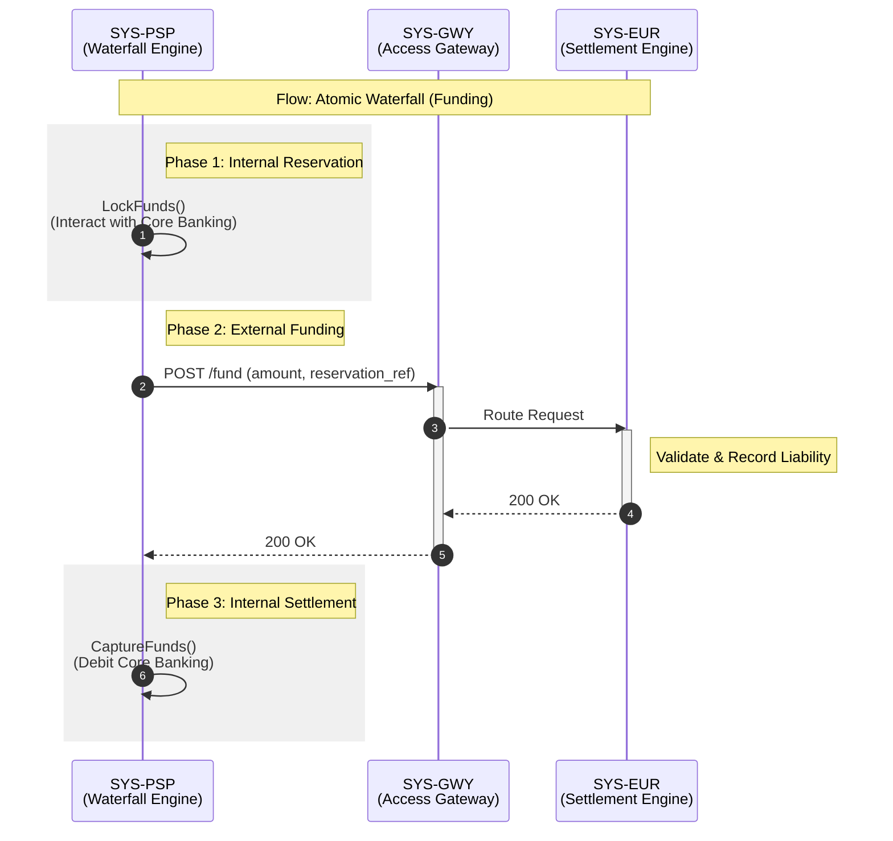
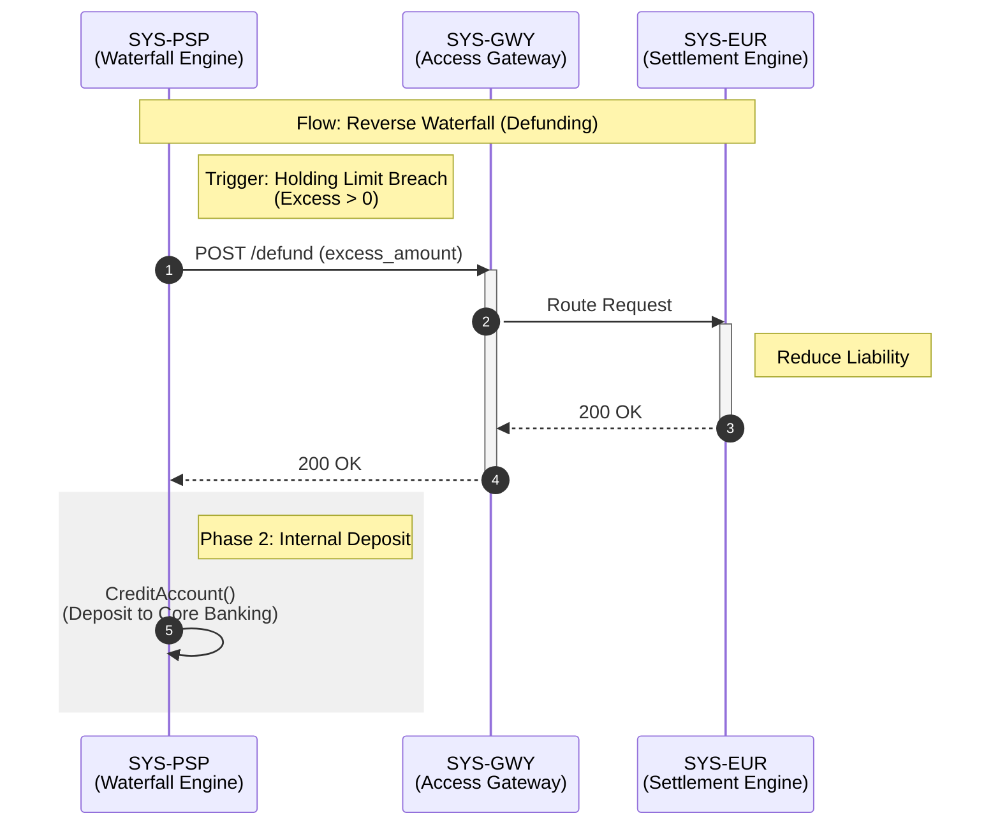

# Liquidity Reservation — Interface Behaviour Specification

## 1. Identification
- **Global ID:** `SPEC-LIQ-INT`
- **Part of Set:** `SPEC-SET-LIQ`
- **Traceability:**
    - **Upstream Spec:** `SPEC-LIQ-FUNC` (Implements `TR-LIQ-04`)
    - **Upstream Arch:** `@arch=SET-ARCH:0.1.0` (Implements `COMP-EUR-05` Interfaces)

## 2. Purpose and Scope

This document defines the **component interactions** required to execute atomic Waterfall operations.

It focuses on the normative interface between the **PSP** and the **Digital Euro Service Platform (DESP)**. Interactions between the PSP and its own Core Banking System are described logically but are implementation-specific (proprietary).

## 3. Component Inventory (Actors)

| ID | Component Name | Role | Responsibility | Trace |
| :--- | :--- | :--- | :--- | :--- |
| **SYS-PSP** | **PSP Waterfall Engine** | Client | Orchestrates the atomic swap. Managing component: `COMP-PSP-02`. | `COMP-PSP-02` |
| **SYS-GWY** | **Access Gateway** | Interface | The Border Control. Authenticates PSPs and routes to DESP services. | `COMP-EUR-05` |
| **SYS-EUR** | **Settlement Engine** | Target | The DESP Core Service. Executes the actual funding/defunding. | `COMP-EUR-01` |

## 4. Interface Operation Catalog

### 4.1 Interface: I_Settlement (Normative)
*Between PSP and Access Gateway (`SYS-GWY`)*

| Op ID | Operation Name | Direction | Functional Trace |
| :--- | :--- | :--- | :--- |
| **OP-LIQ-01** | `fund` | `PSP` $\to$ `EUR` | Issues new Digital Euro. Requires proof of reservation. |
| **OP-LIQ-02** | `defund` | `PSP` $\to$ `EUR` | Reduces Digital Euro balance. Triggered by Limit Breach. |

### 4.2 Interface: I_Funding (Informative)
*Internal to PSP Domain (Zone A)*

| Op ID | Operation Name | Description |
| :--- | :--- | :--- |
| **INT-CBS-01** | `LockFunds` | Proprietary call to Legacy Core to reserve commercial money. |
| **INT-CBS-02** | `CaptureFunds` | Proprietary call to finalize the debit. |

## 5. Interaction Flows

### 5.1 Flow: Atomic Waterfall (Funding)
This flow details the interaction between the PSP's engine and the Eurosystem.

**Visualisation (Normative)**

**Step-by-Step Definition**

| Step ID | Sender | Receiver | Message / Action | Constraints / Rules | Trace |
| :--- | :--- | :--- | :--- | :--- | :--- |
| **STEP-WAT-01** | `SYS-PSP` | `SYS-PSP` | *Internal Lock* | **Action:** Reserve funds in Core Banking. | `REQ-LIQ-FUNC-01` |
| **STEP-WAT-02** | `SYS-PSP` | `SYS-GWY` | `POST /fund` | **Body:** `amount`, `reservation_ref`. | `TR-LIQ-04` |
| **STEP-WAT-03** | `SYS-GWY` | `SYS-EUR` | *Route Request* | Forward to Settlement Engine (`COMP-EUR-01`). | `COMP-EUR-04` |
| **STEP-WAT-04** | `SYS-EUR` | `SYS-EUR` | *Issue* | Create new liability. | `COMP-EUR-01` |
| **STEP-WAT-05** | `SYS-EUR` | `SYS-GWY` | `200 OK` | Return success. | `LIQ-01` |
| **STEP-WAT-06** | `SYS-GWY` | `SYS-PSP` | `200 OK` | Forward success. | `TR-LIQ-05` |
| **STEP-WAT-07** | `SYS-PSP` | `SYS-PSP` | *Internal Capture* | **Action:** Debit Core Banking account. | `REQ-LIQ-FUNC-03` |

### 5.2 Flow: Reverse Waterfall (Defunding)

**Visualisation (Normative)**

**Step-by-Step Definition**

| Step ID | Sender | Receiver | Message / Action | Constraints / Rules | Trace |
| :--- | :--- | :--- | :--- | :--- | :--- |
| **STEP-REV-01** | `SYS-PSP` | `SYS-GWY` | `POST /defund` | **Trigger:** Holding Limit Breach. | `REQ-LIQ-FUNC-04` |
| **STEP-REV-02** | `SYS-GWY` | `SYS-EUR` | *Route Request* | Forward to Settlement Engine. | `COMP-EUR-04` |
| **STEP-REV-03** | `SYS-EUR` | `SYS-EUR` | *Defund* | Destroy/Reduce liability. | `COMP-EUR-01` |
| **STEP-REV-04** | `SYS-EUR` | `SYS-GWY` | `200 OK` | Confirm reduction. | `LIQ-02` |
| **STEP-REV-05** | `SYS-GWY` | `SYS-PSP` | `200 OK` | Forward success. | `TR-LIQ-06` |
| **STEP-REV-06** | `SYS-PSP` | `SYS-PSP` | *Internal Credit* | **Action:** Credit Core Banking account. | `REQ-LIQ-FUNC-06` |

## 6. Technical Constraints

| ID | Constraint | Requirement Description | Trace |
| :--- | :--- | :--- | :--- |
| **INT-LIQ-01** | **Performance** | The `fund` operation MUST complete within 200ms (p99) to ensure the total Waterfall duration (Lock+Fund+Capture) remains acceptable for POS payments. | `NFR-PERF-01` |
| **INT-LIQ-02** | **Idempotency** | The `POST /fund` request MUST carry a `Idempotency-Key` (UUID) to prevent accidental double-funding on network retry. | `INT-OB-04` |

## Appendix: How to Parse This Specification

**For Automation Engineers:**

1.  **Contract Validation (External):**
    - **Source:** Parse **Section 4.1 (Operation Catalog)**.
    - **Target:** Compare against `40-specifications/liquidity-reservation/openapi.yaml` (or the Gateway API definition).
    - *Validation:* Ensure that `OP-LIQ-01` (`POST /fund`) and `OP-LIQ-02` (`POST /defund`) exist and require the mandatory headers defined in `INT-LIQ-02` (`Idempotency-Key`).

2.  **Protocol Compliance (Ordering Check):**
    - Parse **Section 5.1 (Atomic Waterfall Sequence)**.
    - **Logic Check:** Verify that the External call (`POST /fund`) is strictly **sandwiched** between two Internal actions:
        - *Pre-Condition:* Must be preceded by `LockFunds` (or equivalent internal locking step).
        - *Post-Condition:* Must be followed by `CaptureFunds` (or equivalent internal debit step).
    - *Usage:* Use this rule to lint the PSP Adapter's implementation code or integration test logic.

3.  **Traceability Auditing:**
    - Extract the `Trace` column from the **Step-by-Step Definition** tables in Section 5.
    - *Validation:* Ensure every step traces back to a Functional Requirement in `SPEC-LIQ-FUNC` (e.g., `REQ-LIQ-FUNC-01`) or a Component ID in `ARCH-SET` (e.g., `COMP-EUR-01`).

