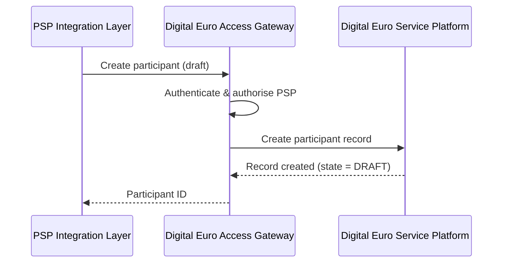
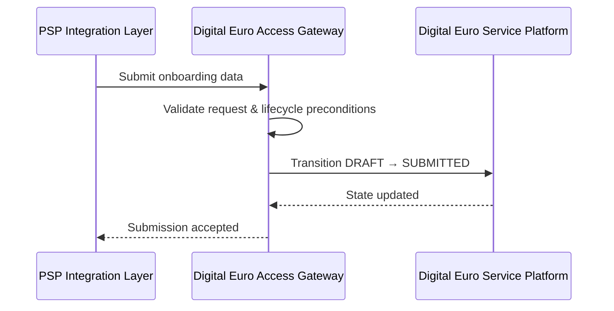
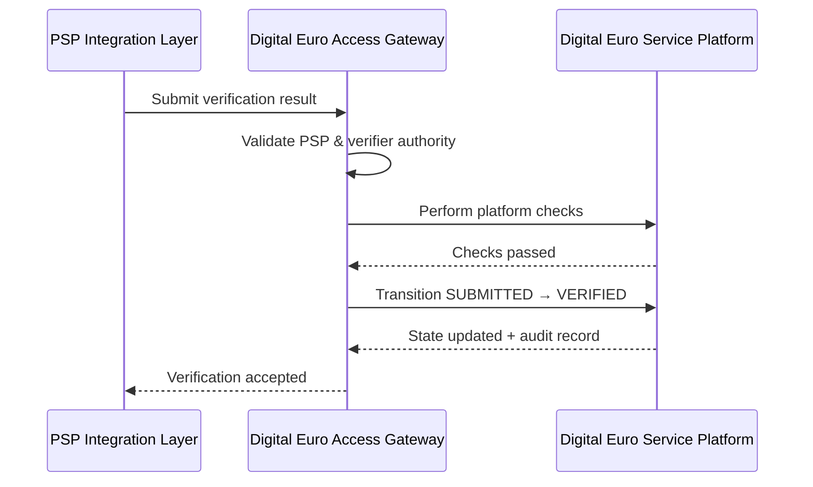
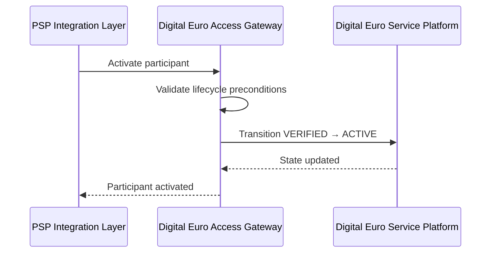

# Participant Onboarding — Interface Behaviour Specification

## Purpose

This document defines the **behavioural interactions between system components**
required to implement the participant onboarding lifecycle.

It bridges:

- the **functional onboarding requirements**, and
- concrete **API and protocol specifications** (e.g. OpenAPI).

This specification defines *what interactions must occur*, not *how they are technically realised*.

---

## Normative references

This specification is constrained by:

- *Participant Onboarding — Functional Specification*  
- *System Architecture — Component Inventory*  

All interactions described here **MUST** comply with the functional requirements and lifecycle rules defined upstream.

---

## Architectural components in scope

This specification applies to the following components:

- **COMP-PSP-01 — Digital Euro Gateway (PSP-side)**  
- **COMP-EUR-04 — Digital Euro Service Platform (DESP)**  
- **COMP-EUR-05 — Digital Euro Access Gateway**  
- **COMP-EUR-02 — Alias Service** (indirectly)

---

## Interaction principles

### INT-G-01 — Layered responsibility

Participant onboarding is a **joint responsibility**:

- **PSP-side gateways** handle client-facing interactions, retries, idempotency, and pre-validation.
- **DESP services**, accessed via the **Access Gateway**, perform authoritative platform operations.

No single component **MAY** bypass this separation of concerns.

---

### INT-G-02 — Canonical platform access

All PSP interactions with DESP **MUST** occur via the **Digital Euro Access Gateway**.

Direct access to internal DESP services **MUST NOT** be exposed.

---

### INT-G-03 — Explicit orchestration

Lifecycle state transitions **MUST** be triggered explicitly.

Neither PSP gateways nor DESP services **MAY** advance onboarding state implicitly.

---

### INT-G-04 — Idempotent invocation

PSP-facing onboarding operations **MUST** support idempotent invocation.

- Idempotency handling is the responsibility of **COMP-PSP-01**.
- Replayed requests **MUST NOT** result in duplicate side effects.
- Conflicting reuse of idempotency keys **MUST** be rejected.

---

## Interface responsibilities

### Digital Euro Gateway (PSP-side) — `COMP-PSP-01`

The PSP-side Digital Euro Gateway **MUST**:

- expose onboarding APIs to internal PSP systems  
- authenticate and authorise PSP actors  
- handle request retries and idempotency  
- perform syntactic and completeness validation  
- invoke the Digital Euro Access Gateway for authoritative operations  

It **MUST NOT**:

- create or mutate authoritative onboarding state within DESP  
- bypass platform validation rules  

---

### Digital Euro Access Gateway — `COMP-EUR-05`

The Access Gateway **MUST**:

- authenticate and authorise PSP system identities  
- validate request semantics and lifecycle preconditions  
- route authorised requests to appropriate DESP services  
- enforce platform-level controls (rate limiting, logging, observability)  

It **MUST NOT**:

- perform PSP-specific business logic  
- process or store end-user PII  

---

### Digital Euro Service Platform (DESP) — `COMP-EUR-04`

DESP services **MUST**:

- persist authoritative participant records  
- enforce lifecycle state integrity  
- perform platform-level checks (e.g. alias uniqueness where applicable)  
- generate audit-relevant events for onboarding decisions  

DESP services **MUST NOT**:

- accept direct calls from PSPs  
- rely on PSP-side state for lifecycle authority  

---

## Interaction flows

### Flow 1 — Draft creation

**Trigger:** onboarding initiation by PSP

1. PSP actor invokes the PSP-side Digital Euro Gateway to create a participant record.
2. The PSP Gateway validates request structure.
3. The PSP Gateway calls the Digital Euro Access Gateway.
4. The Access Gateway routes the request to DESP.
5. DESP creates a participant record in state `DRAFT`.
6. The participant identifier is returned to the PSP.

**Constraints:**
- No eligibility or certification checks are performed.
- The operation MUST be idempotent at the PSP gateway.

---

### Flow 2 — Submission

**Trigger:** explicit submission by PSP

1. PSP actor invokes submission via the PSP Gateway.
2. The PSP Gateway validates completeness.
3. The PSP Gateway invokes the Access Gateway.
4. The Access Gateway validates lifecycle preconditions.
5. DESP transitions the participant from `DRAFT` to `SUBMITTED`.

**Constraints:**
- Incomplete submissions MUST be rejected.
- Duplicate submissions MUST be idempotent.

---

### Flow 3 — Verification

**Trigger:** verification completion by authorised authority

1. Authorised verifier invokes verification via the PSP Gateway.
2. The PSP Gateway validates verifier authorisation.
3. The PSP Gateway invokes the Access Gateway.
4. The Access Gateway routes the request to DESP.
5. DESP performs required platform checks (e.g. alias validation).
6. DESP transitions the participant from `SUBMITTED` to `VERIFIED`.
7. An auditable verification record is generated.

---

### Flow 4 — Activation

**Trigger:** explicit activation decision

1. Authorised PSP or Eurosystem actor invokes activation via the PSP Gateway.
2. The PSP Gateway validates preconditions.
3. The PSP Gateway invokes the Access Gateway.
4. DESP transitions the participant from `VERIFIED` to `ACTIVE`.

**Constraints:**
- Activation MUST NOT be implicit.
- Only verified participants MAY be activated.

---

## Error handling

### INT-E-01 — Invalid state transitions

Attempts to perform illegal lifecycle transitions **MUST** result in:

- rejection
- explicit error response
- audit log entry  

---

### INT-E-02 — Authorisation failures

Unauthorised onboarding requests **MUST** be rejected without side effects.

---

## Mapping to API specifications

The interactions defined in this document are intended to be realised via:

- PSP-facing onboarding APIs  
- Access Gateway platform APIs  
- structured error responses and lifecycle endpoints  

The exact API shape is defined in the accompanying OpenAPI specification.

---

## Relationship to downstream artefacts

This interface behaviour specification constrains:

- OpenAPI definitions  
- component-level implementations  
- automated tests  
- CI/CD validation rules  

Any downstream artefact **MUST NOT** contradict the interaction patterns defined herein.

---

## Disclaimer

This specification is illustrative.

It demonstrates how onboarding responsibilities may be shared between intermediaries and the Eurosystem platform and does not represent an official ECB technical specification.
